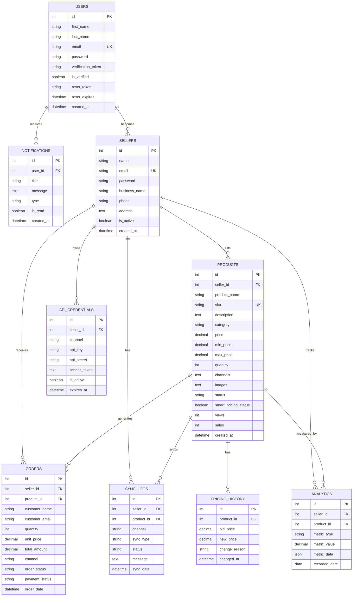

# WalkOn Database Schema - Visual Reference

## 📊 Database Entity Relationship Diagram

## 🗂️ Table Descriptions

### 👤 USERS
**Purpose:** Store user account information
- Primary authentication table
- Handles email verification
- Password reset functionality
- Links to sellers table for business accounts

### 🏪 SELLERS
**Purpose:** Store seller/business profiles
- Extended profile for users who sell products
- Business information and contact details
- One user can have one seller profile
- Manages multi-channel selling

### 📦 PRODUCTS
**Purpose:** Product catalog and inventory
- Central product information
- Multi-channel sync data (stored as comma-separated in `channels`)
- Smart pricing configuration
- Image storage (JSON array in `images` field)
- SKU-based unique identification

### 🛒 ORDERS
**Purpose:** Order management across all channels
- Tracks orders from all sales channels
- Customer information
- Order status and payment tracking
- Links to products and sellers

### 🔄 SYNC_LOGS
**Purpose:** Track synchronization activities
- Logs all channel sync operations
- Error tracking and debugging
- Audit trail for multi-channel updates
- Performance monitoring

### 🔔 NOTIFICATIONS
**Purpose:** User notification system
- System alerts and messages
- Activity notifications
- Read/unread status tracking
- Supports different notification types

### 💰 PRICING_HISTORY
**Purpose:** Track price changes over time
- Historical pricing data
- Analytics and reporting
- Price optimization insights
- Audit trail for pricing decisions

### 📈 ANALYTICS
**Purpose:** Business metrics and KPIs
- Sales performance data
- Product metrics
- Custom metric storage (JSON)
- Time-series data for reporting

### 🔑 API_CREDENTIALS
**Purpose:** Store API keys for channel integrations
- Secure storage of API credentials
- OAuth token management
- Per-channel configuration
- Token expiration tracking

## 🔗 Key Relationships

### User → Seller (1:1)
- A user can become a seller
- Email links the two tables
- Seller inherits user authentication

### Seller → Products (1:Many)
- One seller can have multiple products
- Products belong to one seller
- Cascade delete: removing seller removes their products

### Product → Orders (1:Many)
- One product can have multiple orders
- Orders reference specific products
- Tracks sales per product

### Seller → Orders (1:Many)
- Seller receives orders for their products
- Order management per seller
- Revenue tracking

### Product → Sync_Logs (1:Many)
- Each product sync creates a log entry
- Track sync history per product
- Debug sync issues

## 📋 Index Strategy

### Primary Indexes (Automatic)
- All `id` fields are PRIMARY KEYs with AUTO_INCREMENT

### Unique Indexes
- `users.email` - Prevent duplicate accounts
- `sellers.email` - One seller per email
- `products.sku` - Unique product identification

### Foreign Key Indexes
- `products.seller_id` - Fast product lookups by seller
- `orders.seller_id` - Fast order queries by seller
- `orders.product_id` - Product sales tracking
- `sync_logs.seller_id` - Seller sync history
- `notifications.user_id` - User notification queries

### Search Indexes
- `products.category` - Category filtering
- `products.status` - Status-based queries
- `orders.order_status` - Order status filtering
- `sync_logs.channel` - Channel-specific logs

## 🎯 Data Flow Example

### Adding a New Product
1. User logs in → `users` table authenticated
2. System finds/creates seller → `sellers` table
3. Product created → `products` table
4. Sync to channels → `sync_logs` table
5. Price set → `pricing_history` table
6. Notification sent → `notifications` table

### Processing an Order
1. Order received → `orders` table
2. Product inventory updated → `products.quantity`
3. Analytics recorded → `analytics` table
4. Seller notified → `notifications` table
5. Sync status logged → `sync_logs` table

## 🔒 Security Features

### Password Security
- Passwords stored using PHP `password_hash()`
- BCrypt algorithm (cost factor 10)
- Never stored in plain text

### Token Management
- Verification tokens for email confirmation
- Reset tokens for password recovery
- API tokens with expiration

### Data Integrity
- Foreign key constraints
- Cascade deletes for related data
- Unique constraints on critical fields

## 📊 Storage Considerations

### JSON Fields
- `products.images` - Array of image URLs
- `products.channels` - Stored as TEXT (comma-separated)
- `analytics.metric_data` - Flexible metric storage

### Text Fields
- `description` - Product descriptions
- `address` - Seller addresses
- `message` - Notifications and logs

### Decimal Precision
- All prices: `DECIMAL(10, 2)` - Up to 99,999,999.99
- Supports international currencies

## 🚀 Performance Tips

1. **Use Indexes Wisely**
   - Indexes speed up SELECT queries
   - But slow down INSERT/UPDATE
   - Already optimized for common queries

2. **Pagination**
   - Use LIMIT and OFFSET for large result sets
   - Example: `SELECT * FROM products LIMIT 20 OFFSET 0`

3. **Avoid SELECT ***
   - Only select needed columns
   - Reduces memory usage

4. **Use Prepared Statements**
   - Already implemented in the application
   - Prevents SQL injection
   - Better performance

---

**Database Version:** 1.0  
**Last Updated:** 2026-01-08  
**Compatible With:** MySQL 5.7+, MariaDB 10.2+
